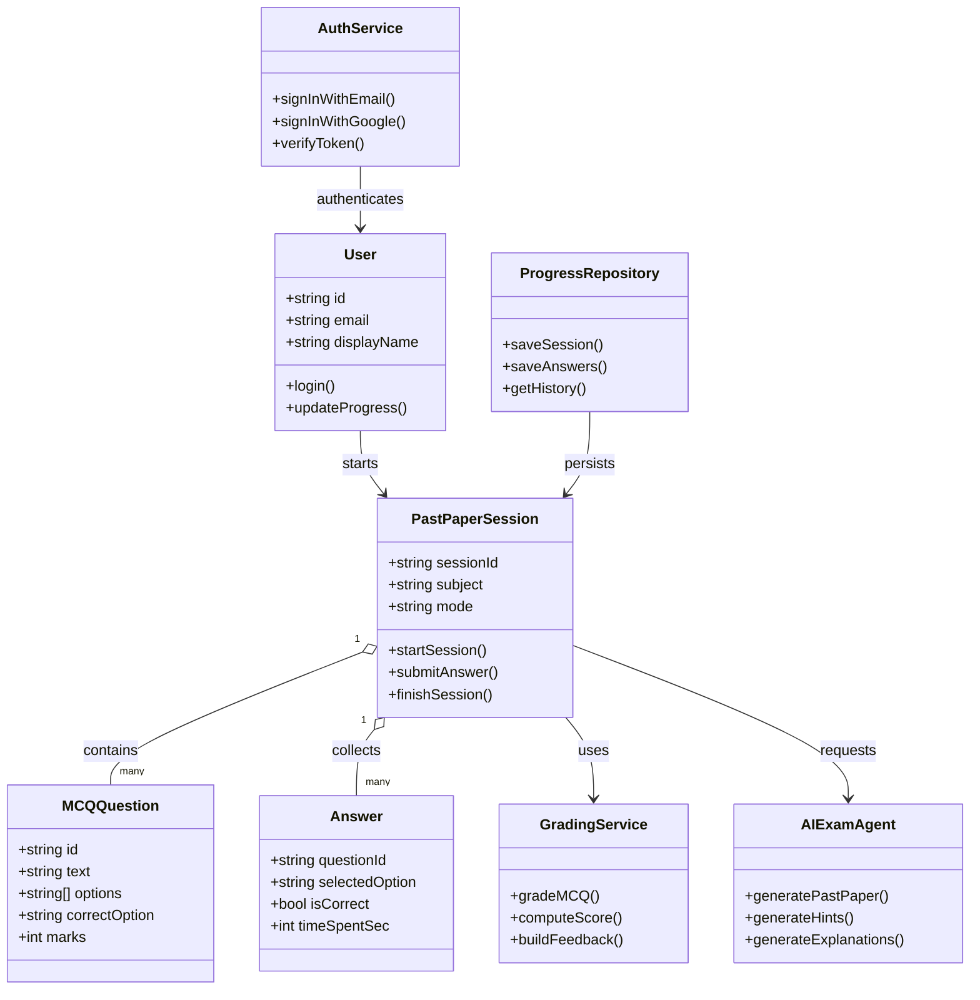
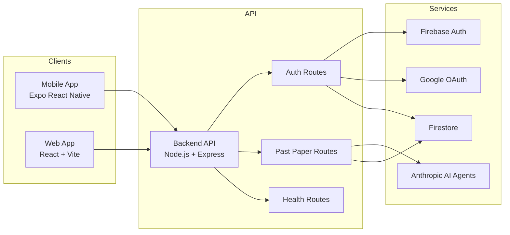
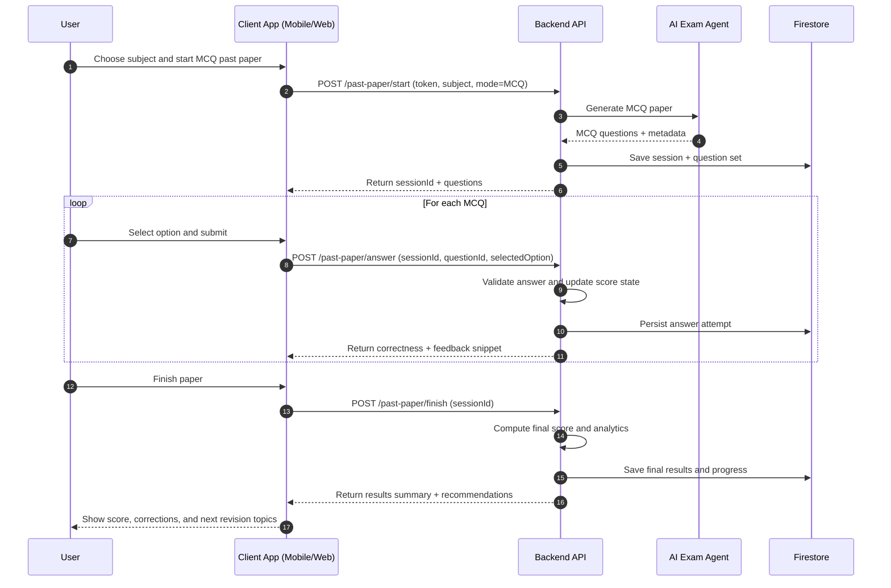
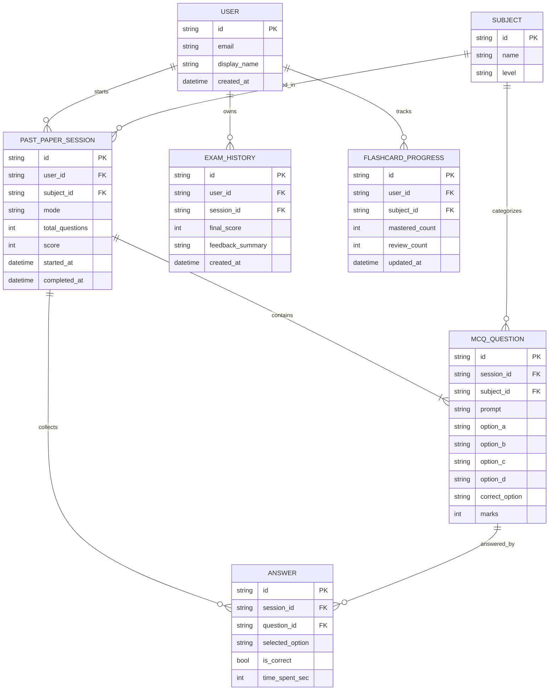
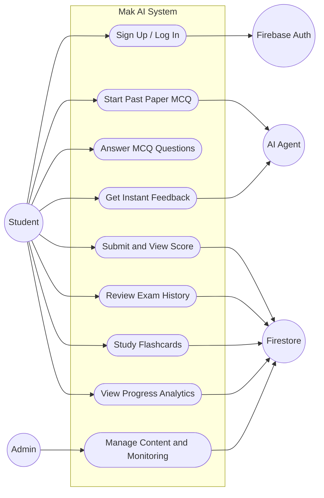

	

	

	
	
	
	
	

	
	

	<b>MAK AI</b> is a multi-platform educational application that helps students practice past papers, answer MCQs, and receive AI-assisted feedback with progress tracking.

	<a href="#1-project-structure">Project Structure</a> •
	<a href="#3-architecture-diagram">Architecture Diagram</a> •
	<a href="#4-sequence-diagram-answering-past-papers-mcqs">MCQ Sequence Flow</a> •
	<a href="#6-er-diagram-core-data-model">ER Diagram</a> •
	<a href="#7-use-case-diagram">Use Case Diagram</a>

This document explains how the Mak AI platform is organized across mobile, web, and backend services.

## 1. Project Structure

The workspace is split into three main apps:

- `Mak-AI/Mak-AI-Frontend/`: React Native + Expo mobile application
- `Mak-AI/Mak-AI-Web/`: React + Vite web application
- `Mak-AI/Mak-AI-Backend/`: Node.js + Express API layer

Supporting files in the root include test scripts (`test-backend.js`, `test-webhook.js`) and operational notes.

## 2. UML Class Diagram (Core Learning Flow)

## 3. Architecture Diagram

## 4. Sequence Diagram: Answering Past Papers (MCQs)

## 5. Notes

- Authentication is handled through Firebase Authentication and Google OAuth.
- Learning sessions and progress data are persisted in Firestore.
- AI agents generate and enrich educational content such as exam items and feedback.

## 6. ER Diagram (Core Data Model)

## 7. Use Case Diagram

## 8. Platform Description (Detailed)

### 1. Project Vision

Build a reliable AI-powered learning platform where students can:

- Discover and practice exam-focused content by subject and level.
- Answer past-paper style MCQs and receive instant feedback.
- Track progress across revision sessions, topics, and flashcards.
- Maintain continuity across mobile and web with persistent account data.

The long-term objective is to move from mixed local-state interactions to complete backend-driven persistence with strong data integrity and analytics.

### 2. Current Implementation Status

Implemented

- Multi-platform experience across mobile (Expo React Native), web (React + Vite), and backend API (Node.js + Express).
- Firebase Authentication with email/password and Google sign-in integration.
- Firestore-backed user and learning data persistence.
- AI-assisted educational features for exam generation and learning support.
- Core study flows: revision modes, custom exam flows, flashcards, and history views.

Partially Implemented / In Progress

- Some learning interactions still rely on frontend-managed state before full synchronization.
- Certain social or notification-driven workflows are scaffolded and require full persistence wiring.
- Advanced analytics and recommendation ranking can be expanded into dedicated backend services.

### 3. Technical Architecture

- Frontend Mobile: Expo + React Native + Expo Router.
- Frontend Web: React + Vite.
- Backend: Express.js API running in Node.js.
- Authentication: Firebase Auth + Google OAuth.
- Data Layer: Firestore as primary persistence store.
- AI Layer: Anthropic-powered agents for exam and content assistance.

### 4. Routing and Feature Mapping

Frontend Navigation (High-Level)

- Onboarding and authentication flow.
- Subject and mode selection flow.
- MCQ and custom exam answering flow.
- Revision and flashcard learning flow.
- Exam history and progress review flow.

Backend API (Current)

- Authentication endpoints under `/api/auth/*`.
- Health and readiness endpoints under `/api/health/*`.
- Core service endpoints for content and learning workflows.

Backend API (Recommended Next)

- `POST /api/exams/start`
- `POST /api/exams/:sessionId/answers`
- `POST /api/exams/:sessionId/finish`
- `GET /api/exams/history/:userId`
- `GET /api/progress/:userId`
- `POST /api/flashcards/review`
- `GET /api/notifications/:userId`

### 5. Data-First Design (Critical Section)

Cardinality and Integrity Rules

- One user can create many learning sessions.
- One learning session contains many questions.
- One session stores many answer attempts.
- One user can own many flashcard progress records by subject/topic.
- One user can have many exam history records.

Constraints to Enforce

- Unique user identifiers and normalized subject codes.
- Session and answer records must always reference valid users and questions.
- Scores and attempt counters must remain non-negative.
- Finalized sessions should be immutable except for teacher/admin corrections.
- Progress updates should be idempotent for retry-safe writes.

### 6. Suggested Target Data Model

Primary Collections / Entities

- `users`
- `subjects`
- `exam_sessions`
- `questions`
- `answers`
- `exam_history`
- `flashcard_progress`
- `notifications`

Recommended Indexed Access Patterns

- `exam_sessions` by `user_id, started_at desc`
- `answers` by `session_id`
- `exam_history` by `user_id, created_at desc`
- `flashcard_progress` by `user_id, subject_id`
- `notifications` by `user_id, is_read, created_at desc`

### 7. Transaction Blueprint (MCQ Submission)

Use a single logical backend operation per answer submission:

1. Validate user token and active session.
2. Validate question belongs to session.
3. Compute correctness and marks for selected option.
4. Persist answer attempt.
5. Update session aggregate score and counters.
6. Emit progress update and optional recommendation hints.
7. Return updated attempt status to client.

For session completion:

1. Lock or mark session as finalizing.
2. Recompute totals from persisted answers.
3. Save final score, summary, and weak-topic insights.
4. Write exam history snapshot.
5. Mark session as completed and return final result payload.

### 8. App Feature Showcase

- Past-paper style MCQ practice with fast feedback loops.
- Subject-based learning pathways and revision modes.
- Flashcard practice with progress tracking.
- AI-enhanced question support and explanations.
- Mobile and web continuity for student study journeys.

### 9. Repository Structure

- `Mak-AI/Mak-AI-Frontend/`: Expo mobile client.
- `Mak-AI/Mak-AI-Web/`: React web client.
- `Mak-AI/Mak-AI-Backend/`: Express API and service integrations.
- Root-level test and operational docs for quick verification.

### 10. Local Setup

Prerequisites

- Node.js LTS
- npm
- Firebase project configuration (Auth + Firestore)
- Backend environment variables in `.env`

Run (Backend)

1. `cd Mak-AI/Mak-AI-Backend`
2. `npm install`
3. `npm run dev`

Run (Mobile)

1. `cd Mak-AI/Mak-AI-Frontend`
2. `npm install`
3. `npm start`

Run (Web)

1. `cd Mak-AI/Mak-AI-Web`
2. `npm install`
3. `npm run dev`

### 11. Practical Next Steps (Production Readiness)

1. Consolidate all exam flows on backend-validated session logic.
2. Complete notifications persistence and read-state syncing.
3. Add robust endpoint-level tests for exam lifecycle and scoring integrity.
4. Introduce analytics dashboards for weak-topic and trend detection.
5. Harden role-based access and operational monitoring for scale.
